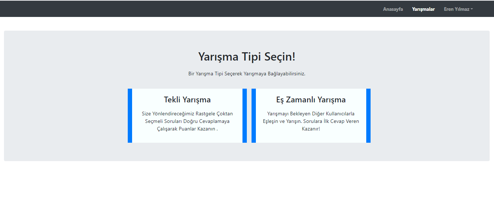
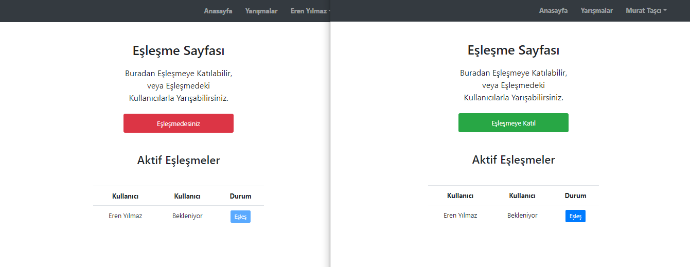
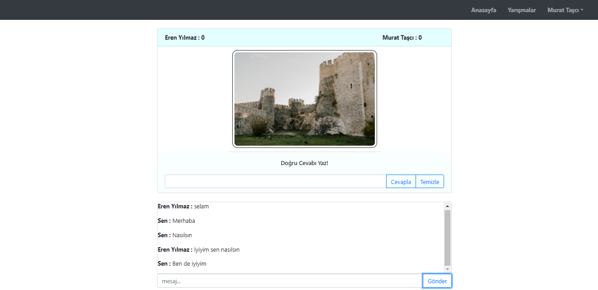

# Gerçek Zamanlı Quiz Uygulaması

## Proje Açıklaması

Bu projenin amacı, SignalR yapısını kullanarak kullanıcılara gerçek zamanlı bir yarışma ortamı sunarak yarışabilmelerini sağlamaktır. Proje .NET 5.0 sürümünde geliştirilmiştir. 

Tamamen gerçek zamanlı çalışan bir eşleşme sistemi oluşturulmuştur. Kullanıcılar bu sistemde kendilerine yarışacak kullanıcı arayabilir, ve ya yarışmayı bekleyen diğer kullanıcılar ile eşleşerek yarışmaya başlayabilirler. 

Projede JWT tabanlı kullanıcı doğrulama sistemi yer almaktadır. Sisteme anlık olarak bağlı olan kullanıcılar, ve sistemde aktif olan eşleşmeler gibi bilgiler statik koleksiyonlarda, yani bellekte tutularak yönetilmektedir.

## Proje Yapısı

Sisteme giriş yapan bir kullanıcı, **"Yarışmalar"** sekmesine tıklayarak tek başına veya aktif kullanıcılarla yarışmak şeklinde yarışma tipini seçebilmektedir. 

Projenin tekli yarışma aşaması hala geliştirilmektedir. Eş zamanlı yarışma seçeneği seçildiğinde, kullanıcı eşleşme sayfasına yönlendirilir.

Eşleşme sayfası tetiklendiğinde, kullanıcı backend tarafında yer alan SignalR Hub'ına bağlanır, ve bağlanırken kendisine atanmış olan eşsiz connection ID'si belleğe kaydedilir.  İstemcinin sunucu ile iletişimi sonlanmadığı takdirde kullanıcının kullandığı istemciye bu id üzerinden erişilebilir. 

Eşleşme sayfası tamamen gerçek zamanlı çalışır. Eşleşmeye katılan, eşleşmeden ayrılan ve birbiriyle eşleşen kullanıcılar eşleşme sayfasını görüntüleyen diğer tüm istemcilerde gerçek zamanlı olarak görüntülenir.

Kullanıcı eşleşme bekleyen bir kullanıcı ile eşleştiğinde iki tarafında **"Hazır"** butonlarına tıklaması gerekmektedir. Hazır olma işlemi tamamlandığında, İki kullanıcı arasında yarışma başlar.

Kullanıcılara aynı anda aynı sorular yönlendirilir. Görüntülenen resmin ingilizcesini ilk doğru cevaplayan kullanıcı 1 puan kazanır. 10 puana ulaşan kullanıcı yarışmayı kazanır.

